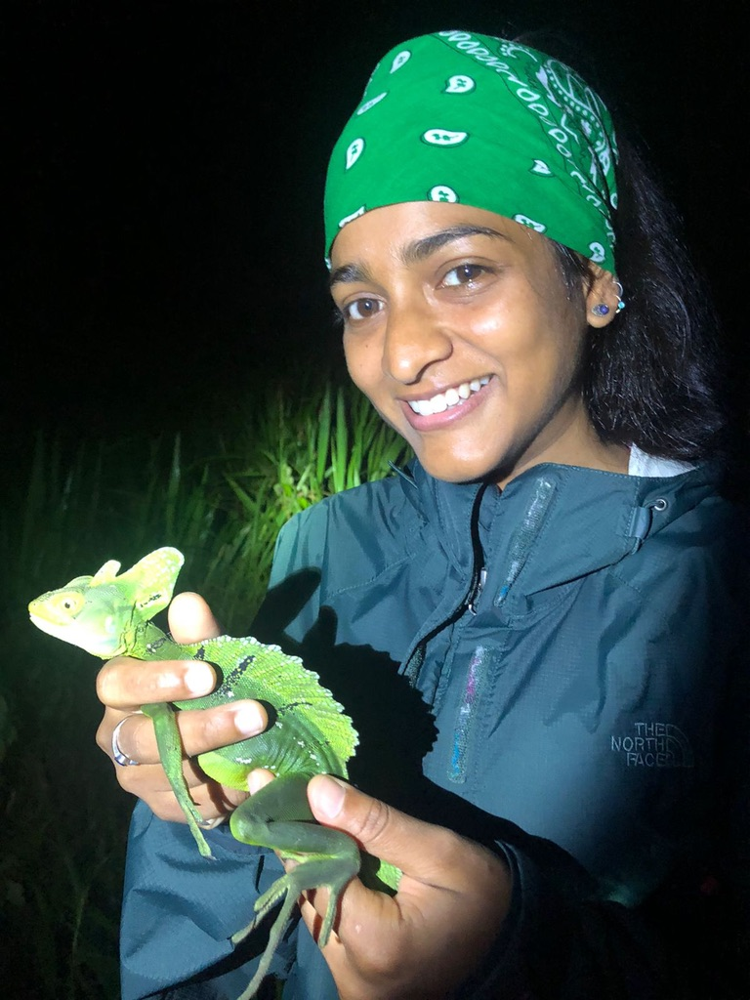
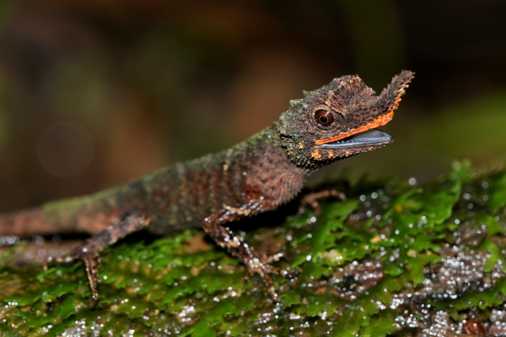
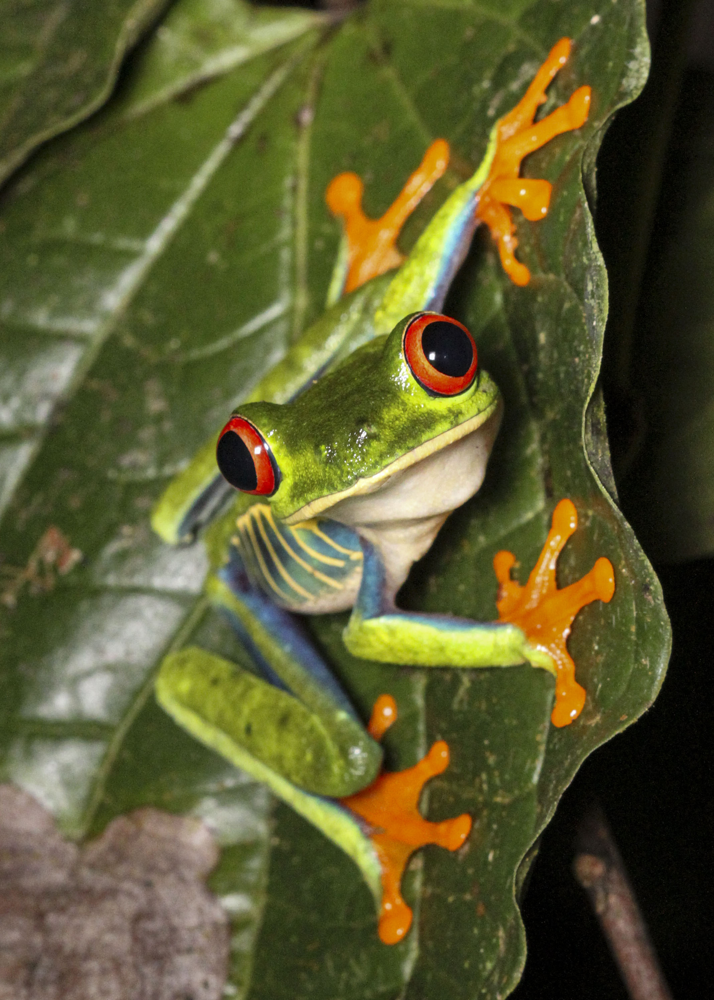
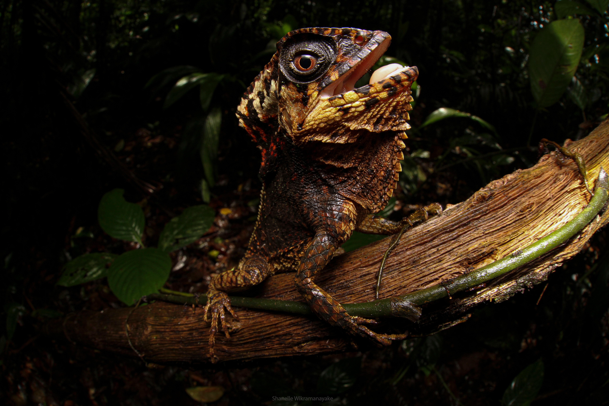
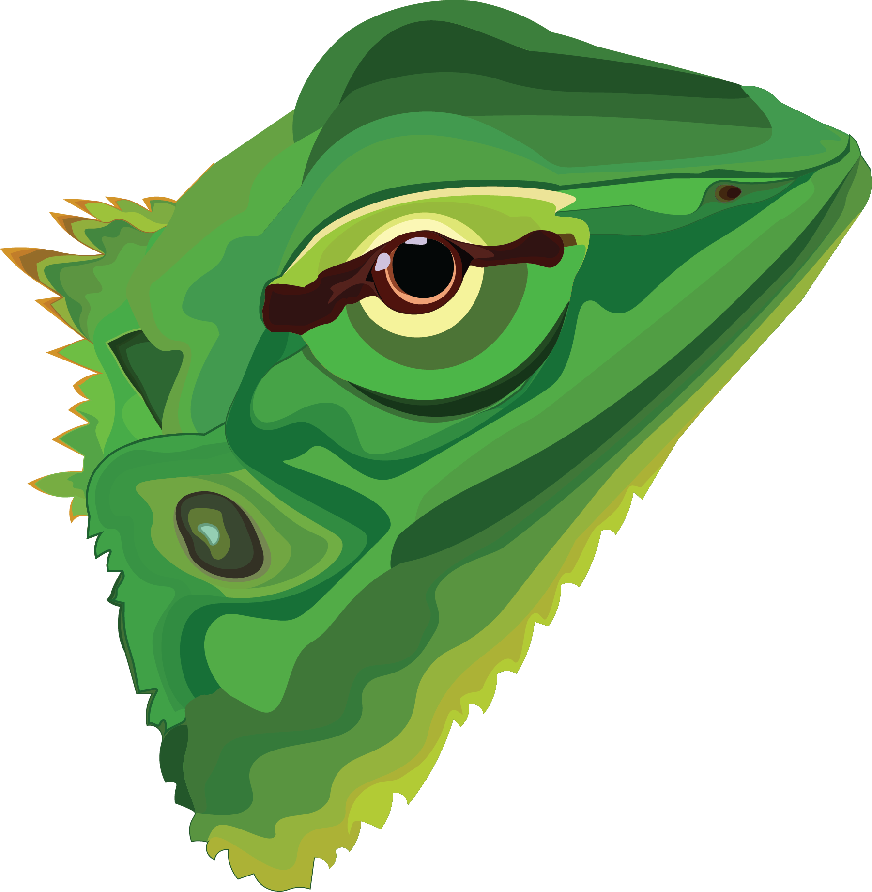
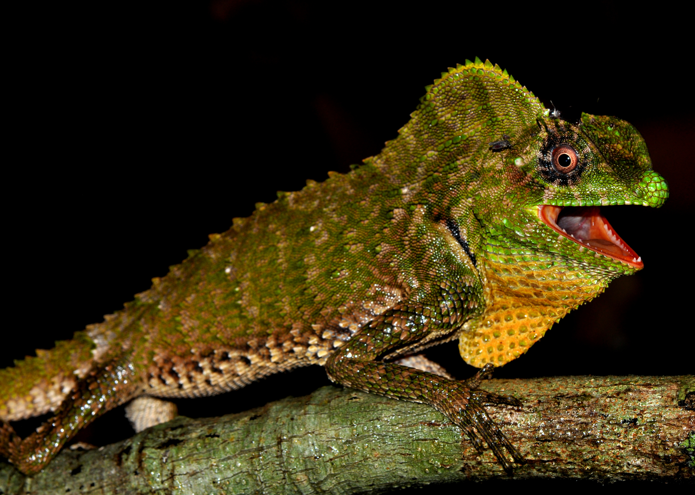

# Who I am and where I came from

Growing up in Sri Lanka, I was surrounded by amazing biodiversity. I especially loved small ectotherms because they are particularly unique and beautiful (but also I am short, and they’re at at eye-level with me, so I notice them often). Unfortunately, habitat fragmentation and climate change are threatening these organisms. 

{width=30%}

I went to the [University of Washington](https://www.washington.edu/) and majored in Biology. I took a class on Physiological Ecology and Evolution, and realised I could use integrative research to conserve the wildlife I grew up around. I did a research project under the guidance of [Dr. Adam Leaché](https://faculty.washington.edu/leache/wordpress/) on the population genetics and phylogeography of the endangered and endemic Sri Lankan Rough-nosed horned lizard (_Ceratophora aspera_). 

{width=50%}

I did my M.S at [California State University, Northridge](https://w2.csun.edu/), where I studied the role of behavioural predating reproductive isolation on speciation in the highly variable Red-eyed treefrog (_Agalychnis callidryas_), under the guidance of [Jeanne Robertson](https://jrobertsonlab.wordpress.com/). 

{width=50%}

Now, I am a PhD student in the [Funk Lab](https://sites.google.com/view/funklab/home?authuser=0) at [Colorado State University, Fort Collins](https://www.colostate.edu/), where I am studying the impacts of habitat fragmentation and climate change on endemic species from the wet zone rainforests of Sri Lanka. I am excited to get experience in integrating physiology and genetic tools to conserve the species I love. I am taking this class because it’s an opportunity to get structured experience with bioinformatics, which is essential for conservation genetics.
 

Some of my hobbies are:

1. Nature photography
1. Digital Art
1. Jewellery making 

{width=40%} {width=25%} {width=25%}

# Research Interests

I am broadly interested in evolutionary ecology. I am especially interested in fragmentation and climate change effects and local adaptation in tropical ecosystems, and using tools in genomics and physiology to come up with holistic conservation management plans. 

## Influential papers

@manel2003landscape illustrates how landscape genetics combines the fields of landscape ecology and population genetics are integrated to describe how environmental and landscape factors affect patterns of gene flow across landscapes. Landscape genetics can be incredibly usefl for conservation management as it allows identification factors that facilitate or impede geneflow for organisms or ecological corridors for species specific management [@segelbacher2010applications]. Thus, I hope to use these methods to test the effects of forest fragmentation and environment/climate on the Sri Lankan Lyre-headed lizard (_Lyriocephalus scutatus) [@bruggeman2010relative]. This species is found in the Moist Forest Ecoregion, which encopesses the highly fragmented tropical rainforests of Sri Lanka [@wikramanayake2022sri]. We anticipae that their populations may have low genetic diversity if they are unable to move through the forest matrix since they're forest obligates.   

{width=40%}

## The mathematics behind my research
I recently learned about the Wahlund effect, which is the deficit of heterozygotes relatve to Hardy Weinburg proportions. It is calculated by looking at the excess of homozygtes and deficit of heterozygotes in terms of the variance of allele frequencies among S subpopulations. It can be calculated using this equation.
$$
Var(q) = \frac{1}{S}\sum(q_{i}-\overline{q})^2
$$
When the variance of allele q is 0, the population is in HW proportion since all subpopulations have the same allele frequency for allele q. When the variance of q increases, differences in allele frequency among populations also increases, so you can calculate F<sub>st.
$$
F_{st} = \frac{Var(q)}{pq}
$$
## My computing experience

I have some experience with R. I used it a lot during my undergraduate and MS research. During my MS I learned about Tidyverse. Here's some of my code to clean my data from my MS. This is behaviour data from behavioural trials of red-eyed treefrog females in response to male stimulus treatments. I used the program Boris to score the trial videos which generated an ethogram. Its not great, but it's what I know!

```
boris23 <- read_csv(here("Data", "AllObservations23.csv"))
glimpse(boris23)
#view(boris23)

####Clean data####
boris_clean23 <- boris23 %>% 
  dplyr::rename(Observation_id = "Observation id", 
                Observation_date = "Observation date", 
                Total_length = "Total length", 
                Start = "Start (s)", 
                Stop = "Stop (s)", 
                Duration = "Duration (s)") %>% 
  dplyr::select(Observation_id, 
                Stimulus_Type, Behavior, 
                Start, Stop, 
                Duration) %>% 
  filter(Behavior != "End" & Behavior != "Miscellaneous") %>% 
  mutate(Behavior = factor(Behavior, 
                           levels = c("Flank_Display_Courtship", 
                                      "Back_Display_Courtship",
                                      "Flank_Display_Exploratory", 
                                      "Back_Display_Exploratory", 
                                      "Drop_in_Courtship",
                                      "Drop_in_Exploratory", 
                                      "Moving",
                                      "Orient", 
                                      "Approach",
                                      "Exploring",
                                      "Static", 
                                      "Escape", 
                                      "Gone", 
                                      "No visual", 
                                      "Start"))) %>% 
  mutate(Stimulus_Type = factor(Stimulus_Type, 
                                levels = c("LaSelva", 
                                           "Bijagual",
                                           "Annae",
                                           "Saltator",
                                           "Spurelli"))) %>% 
  mutate(Observation_id = dplyr::recode(Observation_id, 
                                        F0.08_230701_AP_Part1 = 'F0.08_230701_AP', 
                                        F0.08_230701_AP_Part2 = 'F0.08_230701_AP', 
                                        F0.21_230706_AP_Part2 =  'F0.21_230706_AP', 
                                        F0.32_230715_Part2 = 'F0.32_230715')) %>% 
  dplyr::filter(Observation_id != "F0.01_230626_Practice")

glimpse(boris_clean23)

```
I also made my personal website it github pages, so I self taught the minimum markdown I needed to do this. Here is some code from the page I intrduce my photgraphy.

```
---

layout: page
title: "Photography"
permalink: /https://shanellewiks.github.io/photography/

---
##### I enjoy taking pictures of nature and wildlife. My fieldwork takes me to tropical rainforests where I get to see many incredible organisms. I'm excited to share my experiences with others through my pictures.


##### _Otocryptis weigmanni_ from Gongala forest reserve made it on the cover of _Herpetological Review_



  

  
 

```

## What I hope to get out of this class

Give me a bullet list of three things:

* Skills in producing reproducible data
* Skills in unix programming 
* Bioiformatics experience with multiple types of genomic data

# Evaluating some R code
A plot using the Palmer Penguin dataset [@horst2022palmer].
```{r, message=FALSE, warning=FALSE}

library(tidyverse)
library(ggplot2)
library(palmerpenguins)

#view(penguins)
penguins <- penguins

penplot <- penguins %>% 
  ggplot(aes(x = bill_length_mm, y = bill_depth_mm, colour = species))+
  geom_point()+
  labs(title = "Penguin bill depth and bill length for three species of penguins from the Palmer Penguin dataset")
penplot

```

# Citations

